## Part 1. Готовый докер
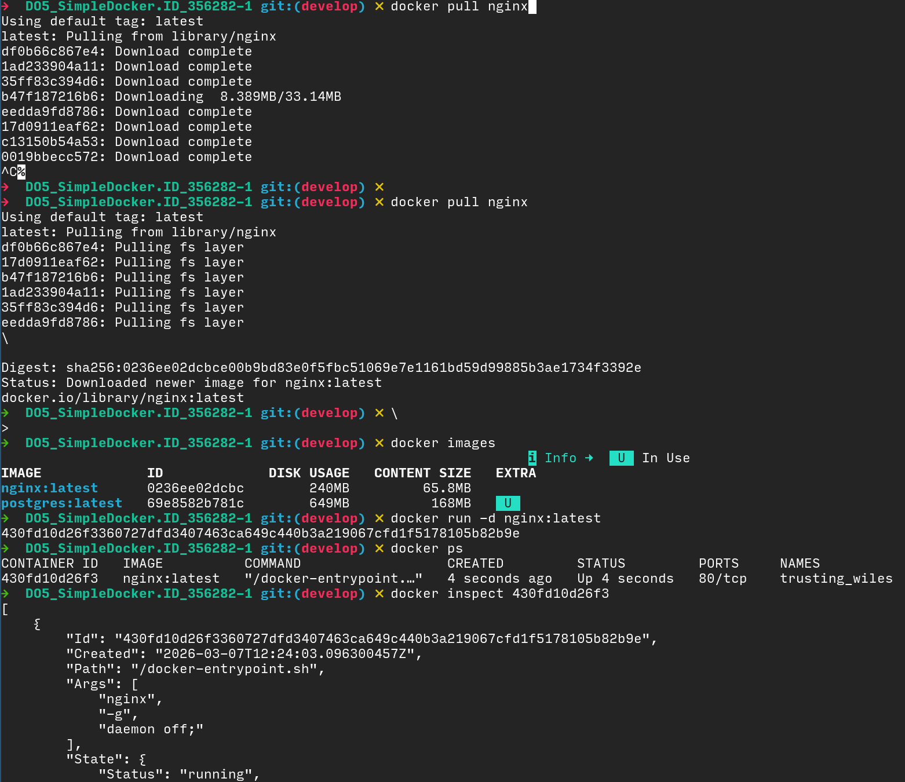
- Замапленные ip, порты: 80/tcp открыт , но не замапплен на хост порт
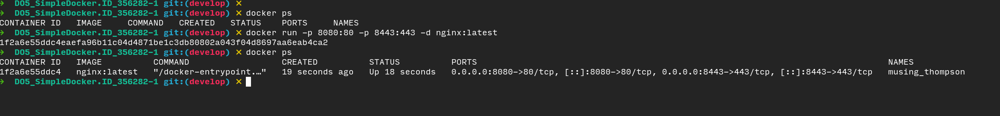
- теперь порты контейнера 80 и 443 привязаны к портам хоста 8080 и 8443 соответственно на адресах 0.0.0.0 (на всех интерфейсах)
- *чтобы сделать маппинг на порты хоста 80 и 443 докеру нужны рут права, так что для задания использую альтерантивные порты.*
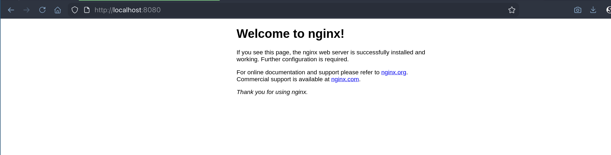
## Part 2. Операции с контейнером
- чтобы достать из контейнера конфиг использую команду: 
`docker exec -it <имя контейнера> cat /etc/nginx/conf.d/default.conf > task2/default.conf`
- затем вставляем в конфиг с помощью docker cp такой блок:
`location /status {
        stub_status on;
   	}`
- после чего перезагружаем сервер комадной `docker exec -it <имя контейнера> nginx -s reload` и заходим на http://localhost:8080/status
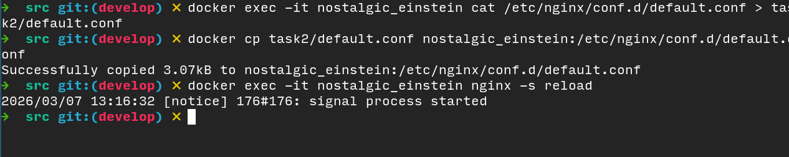
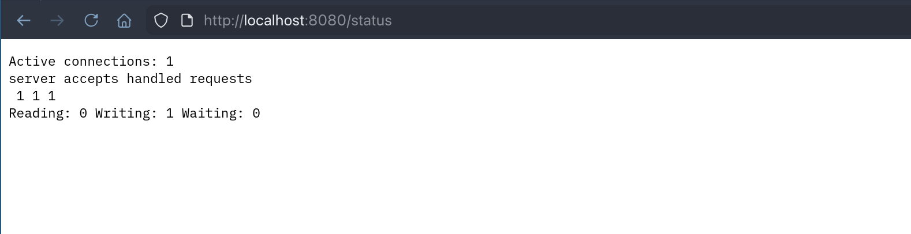
- делаем бекап и удаляем контейнер: 
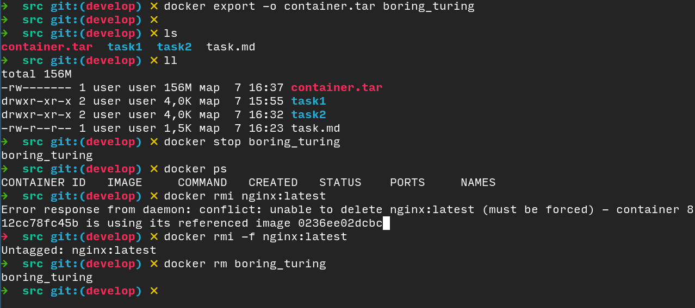
- импортируем архив обратно командой `docker import container.tar mynginx:local`
и запускаем заново
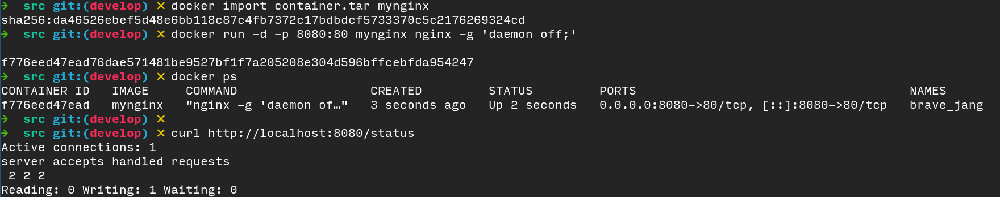
## Part 3. Мини веб-сервер
- берем код из materials и немножко чиним его (а именно добавляем строчку `FCGX_Init();` в начале) и компилируем его в fcgi_hello 
- поднимаем nginx в докере с пробросом локального порта 8081 на порт контейнера 81 (чтоб без рут доступа). 
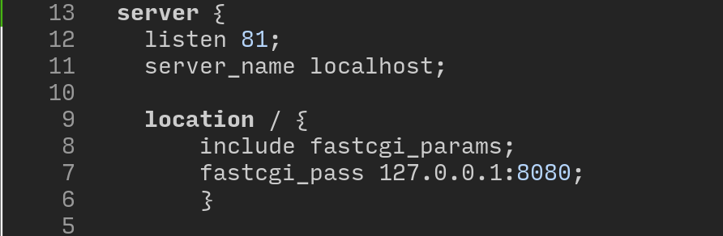
- Передаем в контейнер с помощью docker cp приложение fcgi_hello, чтоб его запустить из контейнера, понадобятся библиотеки libfcgi, скачиваем их внутри контейнера, а затем правим конфигурацию nginx внутри, добавляем редирект с порта 81 на адрес fcgi
- Запускаем ./fcgi_hello и перезапускаем nginx.
- видим, что сайт работает.
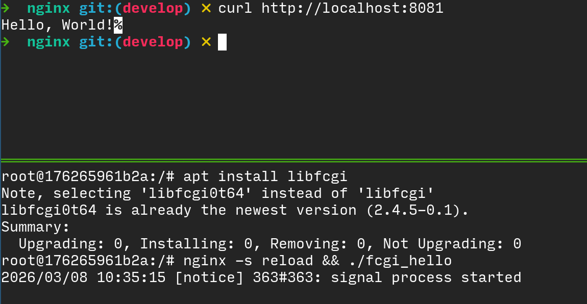
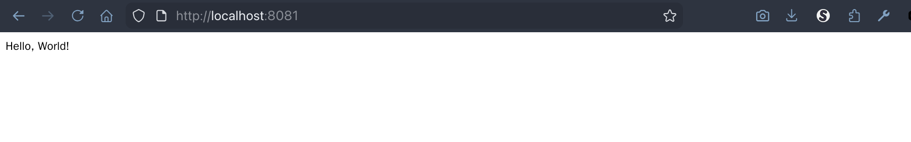
## Part 4. Свой докер
- Dockerfile для создания кастомного образа nginx. 
- Собираем новый образ: `docker build -t mynginx-alpine .`
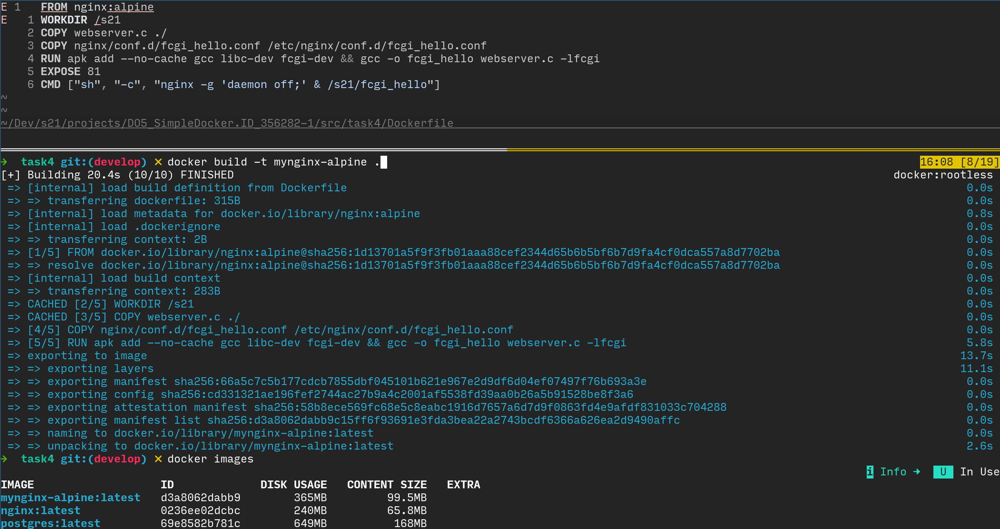
- Запускаем образ, даем контейнеру имя "nginx-fcgi" `--name nginx-fcgi`, мап порта 8080 локальной машины на порт контейнера 81 `-p 8080:81`, маппинг директории /nginx/conf.d c хоста по адресу /etc/nginx/conf.d внутри контейнера `-v ./nginx/conf.d:/etc/nginx/conf.d`.
*Получилось так:* `docker run --name nginx-fcgi -d -p 8080:81 -v ./nginx/conf.d:/etc/nginx/conf.d mynginx-alpine`
- Проверяем что все работает:
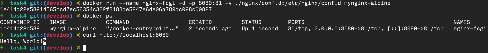
- Теперь добавляем в конфиг директиву  `location /status {
        stub_status on;
   	}`
и после обычного рестарта контейнера без пересборки видим, что есть доступ к статистике:
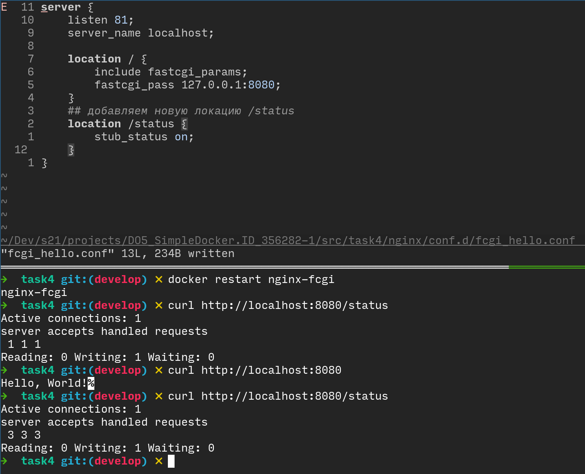
## Part 5. Dockle 
Чтобы отсканировать локальный образ через dockle сначала сохраняем образ в архив командой `docker save mynginx-alpine:latest -o myimage.tar`
затем проверяем через Dockle: `dockle --input myimage.tar`
- видим вот такую простыню:
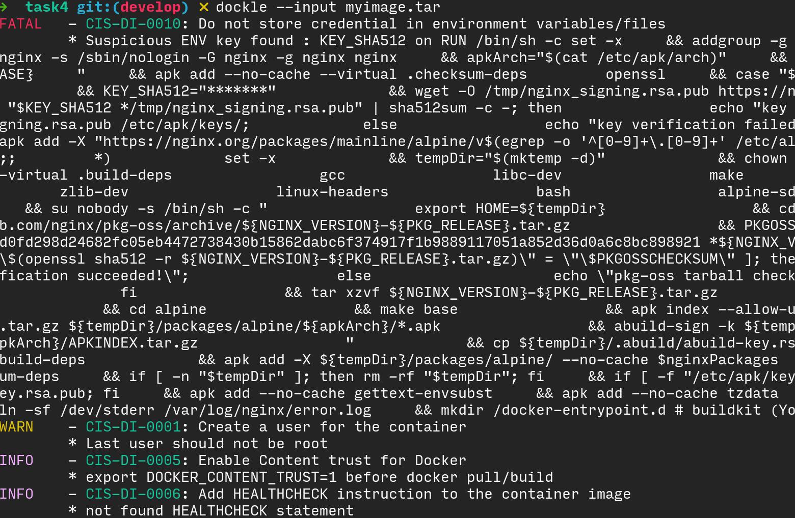
Посоветовавшись с LLM: 
*Причина: в официальных Docker-файлах nginx используется этот шаблон контрольной суммы при проверке ключа; это не секрет.
Реальность безопасности:
Утечки учетных данных не происходит.
Переменная ограничена уровнем оболочки RUN.
Она содержит открытый хеш открытого ключа подписи.
Поэтому оповещение является эвристическим ложным срабатыванием, вызванным правилом ключевых слов сканера.*

Иными словами в официальных образах Nginx в ENV переменную вшита контрольная сумма для проверки какого-то публичного ключа, эта сумма хранится в переменной KEY_SHA512 и Dockle видя в названии переменной 'KEY' думает, что это какая-то секретная информация, которую не следует хранить таким способом. 
Можно просто игнорировать данную ошибку, но можно пересобрать кастомный образ используя что-то другое как базовый образ. 
- попробуем использовать base образ debian:trixie-slim вместо nginx-alpine и установить nginx как зависимость:
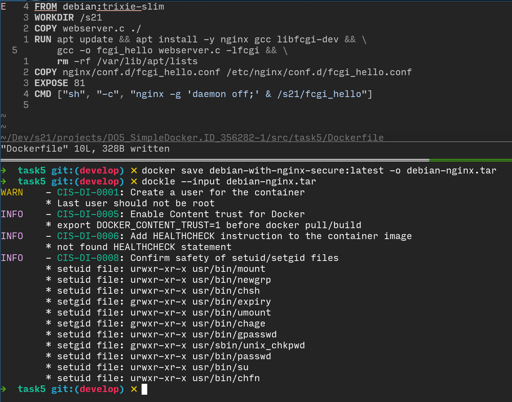
- ошибок нет
## Part 6. Базовый Docker Compose
- все работает
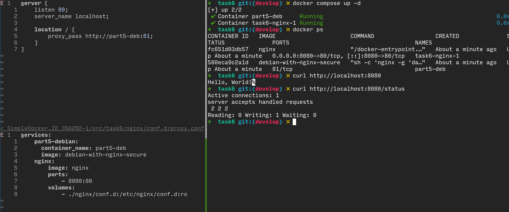

